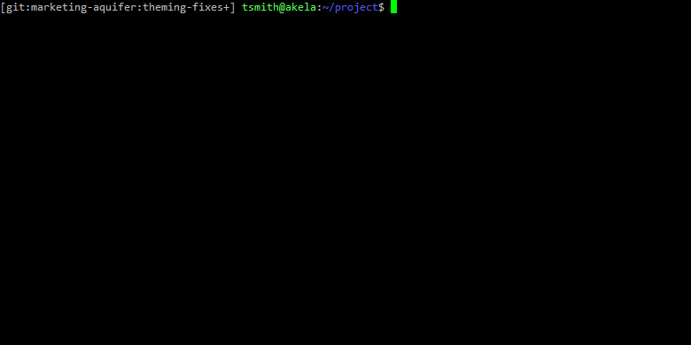

# Cleaner History with Interactive Commit Building in Git

My home is a cluttered place, so my quest for tidiness takes other, more
obscure forms: maintenance of a _pristine_ Git repository history that explains
why and how the project took shape as it did.

Sometimes when building a feature, making theming adjustments, or trying to meet
a deadline, it's easy to get in the weeds and write a ton of code. This happens
to me a lot when I'm handling a client's change order, tweaking the frontend
as new features take shape, or building new functionality in Drupal 7
using Features. Committing it all at once is quick, but leaves other developers
(and sometimes myself...) unable to follow my train of thought. Being able to
tell a story with code comments and history is key to maintainability.

**Git's Interactive mode for selecting files and diff hunks to add to the
staging area makes it easy to break down a dirty working tree into small,
well-documented commits.**

_Wait, is this the same thing as patch mode?_ If you're using patch mode, you're
already my kinda crazy. Patch mode is a component of interactive mode, and I'll
explain both.

## Patch Mode

Patch Mode: `git add -p` asks if you want to add, skip, or edit each
individual hunk (a piece in a diff), in order. In a pre-launch rush, I made a
lot of quick theming adjustments. Once the frontend looked like I wanted it, I
wanted to split up the commits sensibly. I'll start with the field instance
adjustment. I want only those two lines in this commit, and nothing else.


_\* Don't include compiled CSS/minified assets if you can avoid it, this repo
includes it because of build process reasons._

After selecting or rejecting individual hunks, I've built this staging area,
which would only commit the differences I had selected in the Feature module.
I'll repeat this process for the rest of my unstaged changes.

At each hunk, git asked me what to do, here are those options:

```
Stage this hunk [y,n,q,a,d,/,j,J,g,e,?]? ?
y - stage this hunk
n - do not stage this hunk
q - quit; do not stage this hunk nor any of the remaining ones
a - stage this hunk and all later hunks in the file
d - do not stage this hunk nor any of the later hunks in the file
g - select a hunk to go to
/ - search for a hunk matching the given regex
j - leave this hunk undecided, see next undecided hunk
J - leave this hunk undecided, see next hunk
k - leave this hunk undecided, see previous undecided hunk
K - leave this hunk undecided, see previous hunk
s - split the current hunk into smaller hunks
e - manually edit the current hunk
? - print help
```

I usually just use `y` and `n`. Using `q` would let me skip the other files once
I knew I'd picked up the changes I was looking for. Using `s` is great if git
groups up nearby unrelated changes into a single hunk. Using `e` is fun if you
want to record multiple changes to a single line or adjacent lines (which `s`
won't split), but keep in mind you'll be manually editing a diff and it needs to
apply cleanly.

Patch adding is great if:

- You don't have too many modified files
- You're committing changes, not new files (patch adding doesn't show you
  untracked files, the way `git diff` doesn't)
- All the differences are worth reading: I believe in running a `git diff`
  before committing to double-check, but Features module exports, SVGs, compiled
  CSS or JS assets, or updated core/contrib files usually aren't worth reading.
  In my example, you saw a diff of a minified CSS file we unfortunately had to
  track; I don't want to read that.

You should try interactive adding if you find yourself wishing you could patch
in some changes, but easily stage other entire files or untracked files, like:

- Pick the Sass changes, but just add all field instance or Panels exported settings
- Pick up untracked Sass partials and patch in the line that includes them

## Interactive Mode

Interactive Mode: `git add -i` launches an interactive prompt, starting with the
status of your work tree: new files or directories, changed files, and deleted
files. Then it asks how you want to handle it all. Let's re-run my last commit
using interactive mode; I'll just `update` the two Features export files, quit
out of the prompt, and commit. No reading diffs, no messing with unrelated
files.



The `update` mode just stages the entire file for each file you select. For any
of these modes, the next prompt asks you to pick files by number that you want
to operate on; hitting enter without specifying another file continues to the
next step. So I marked to `update` both of the Features exports.

Tackling the frontend changes, I'd like to `patch` in the Sass changes, but just
`update` the compiled CSS output. As an example, I'll stage the menu changes but
not fix my colleague's whitespace blunder at the end of the file:


Your options at the prompt are:

```
*** Commands ***
  1: status       2: update       3: revert       4: add untracked
  5: patch        6: diff         7: quit         8: help
What now> h
status        - show paths with changes
update        - add working tree state to the staged set of changes
revert        - revert staged set of changes back to the HEAD version
patch         - pick hunks and update selectively
diff          - view diff between HEAD and index
add untracked - add contents of untracked files to the staged set of changes
```

You can enter the number or the highlighted letter to activate that mode:

- You've seen update and patch.
- `status` repeats the status list: useful between operations
- `revert` behaves differently here than if you enter `git revert`: it'll
  "unstage" a file back to HEAD, but _it will leave your changes in the working tree._
- `add untracked` allows easy staging of new files: useful in combination with
  `patch` when adding and importing new Sass partials, for example.
- `diff` will let you review diffs of what you have staged: like a file-by-file
  `git diff --cached`

## TL;DR:

Building narrowly focused commits using patch (`git add -p`) or interactive
(`git add -i`) adding allows you to build a sensible code history that will
help your teammates and future maintainers understand your thought process.
Also, breaking up lots of work into multiple commits makes merging easier.
