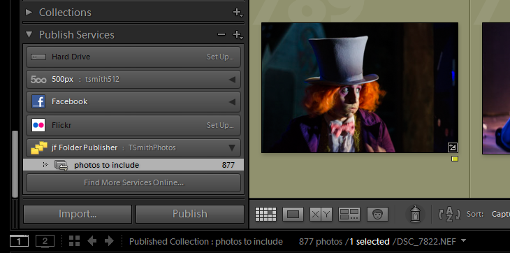
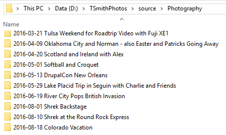
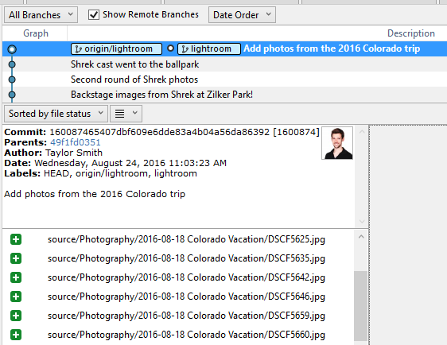
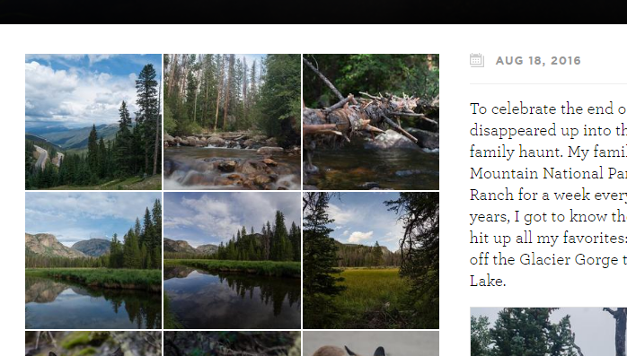

# Making a Photoblog with Lightroom, Jekyll, and Gulp

In middle school, I eagerly sweet-talked my Dad, who still maintains that
computers are a fad, into helping me acquire a “domain name.” It was the start
of a long journey into web development, design, and a photography hobby.
Sometime in college, I stopped maintaining that first site, but I kept the
unused domain parked and paid for because I couldn’t let go of what it meant to
me. This summer, I decided to put it back to good use.

## A Playscape for Photos and Tech

I wanted to build
[a simple, personal place to post a bunch of photos](http://www.tsmithphotos.com/)
and some written content that was easy to update. Like before, I also wanted it
to be a place to experiment with different techniques and tools. But since this
isn’t 2002 anymore, no Dreamweaver or Flash this go’round…

## Lightroom Setup and Folder Structure

I use Lightroom to organize and edit my photos, but they’re all stored in dated
and named folders (e.g., “2016-08-18 Colorado Vacation”). That hierarchy would
make it easy to store them on the web, too. I wanted a way to use Lightroom’s
Publish functionality to make resized exports of originals that maintains the
directory structure.
[Jeffrey Friedl’s Folder Publish](http://regex.info/blog/lightroom-goodies/folder-publisher)
plugin accomplishes exactly this.

I add images to the aptly named “photos to include” collection that Folder
Publisher provides, and Lightroom automatically handles making new folders of
converted and resized JPEGs, maintaining that original structure:

Using SourceTree, I commit the parent directory to a Git repository:

## Image Processing and Indexing with [Gulp](http://gulpjs.com/)

Once I have the exports from Lightroom, I have a couple [custom gulp tasks](https://github.com/tsmith512/tsmithphotos/blob/master/gulpfile.js) to
handle the logistical needs of indexing and optimizing these images for the site
build.

I want the images to appear with very high quality, but the JPEGs from Lightroom
are bigger than they need to be. I use a
[gulp task called `photos`](https://github.com/tsmith512/tsmithphotos/blob/master/gulpfile.js#L175-L200)
to automate the processing steps.

* create three different sizes (the full size for heros and lightbox displays,
  medium for in-content images, and thumbnails)
* losslessly compress them further with [gulp-imagemin](https://github.com/sindresorhus/gulp-imagemin)
* [make them progressive](http://blog.patrickmeenan.com/2013/06/progressive-jpegs-ftw.html)
  so they appear to load a bit quicker
* [collapse spaces and lowercase letters in those directory names](https://github.com/tsmith512/tsmithphotos/blob/master/gulpfile.js#L83)
  so they’re shorter and make more friendly URLs

[Another task](https://github.com/tsmith512/tsmithphotos/blob/master/gulpfile.js#L74-L173)
indexes all the images by collecting image sizes and their EXIF metadata,
sorting all of it by exposure time, and then
[storing it in a YAML file](https://github.com/tsmith512/tsmithphotos/blob/master/source/index.yml)
so that galleries can be built automatically.

Finally, another task creates a new post in the site for any folder that doesn’t
already have one, since my post and directory names are built the same way.

Other gulp tasks build out the Sass into stylesheets, _aggregate/minify/lint JS_,
nd copy other files directly into the `_site` output directory.

## Site Building with Jekyll

[Jekyll](https://jekyllrb.com/) (and the [Liquid](https://shopify.github.io/liquid/)
templating engine it uses) allows for a lot of flexibility without writing
custom Ruby plugins if you’re willing to dizzy yourself with a few nested `for`
loops and use [custom site data files](https://jekyllrb.com/docs/datafiles/).

With so much of the asset processing and indexing for this site already done by
Gulp tasks, the Jekyll configuration is is quite simple and is focused only on
generating HTML pages. Jekyll reads the YAML index file that gulp made into the
variable `site.data.index` when it starts building the site. A `for` loop over
`site.data.index[gallery]` (where `gallery` is the directory name) returns a hash
([similar to an associative array](http://stackoverflow.com/questions/3134296/hash-tables-vs-associative-arrays))
with each image and all the metadata generated. I use this loop to
[create a list of thumbnails and links](https://github.com/tsmith512/tsmithphotos/blob/master/_layouts/post.html#L47-L61):

Finding individual images can get a little hairier, for example, when trying to
find the “hero” image for a given post. Rather than being able to lookup an
element of the hash by one of its properties, Liquid requires looping over all
elements in the array until you find what you want because Jekyll’s `where`
filter doesn’t seem to work on custom data.
[In this case, looking for an element marked `hero`](https://github.com/tsmith512/tsmithphotos/blob/master/_layouts/post.html#L18-L34).
Adding both techniques together and nesting them in a loop of all posts in the site is
[how the home page is generated](https://github.com/tsmith512/tsmithphotos/blob/master/index.html):

## Performance Considerations

Even with big photos saved at high quality settings, I wanted to prove this
could still be a fast site.

### Reducing JavaScript

PhotoSwipe is a fairly lightweight gallery plugin with no dependencies, but I
can reduce JS weight further by only loading PhotoSwipe when it is needed.

[Add “photoswipe: true” to the front-matter of the Post template](https://github.com/tsmith512/tsmithphotos/blob/master/_layouts/post.html#L3).

1. Check [for that value in the Default template](https://github.com/tsmith512/tsmithphotos/blob/master/_layouts/default.html#L23)
   before including the aggregated Photoswipe file.
2. And I get the benefit of not including jQuery because neither PhotoSwipe or
   my custom JS functions require it! You may not need jQuery either; take a
   look at [You Might Not Need jQuery](http://youmightnotneedjquery.com/) to see
   examples of how to accomplish common tasks using plain, cross-compatible
   JavaScript. Or for a little humor on the subject, check out the satirical
   site for the [VanillaJS](http://vanilla-js.com/) “library” and its code
   examples which feature some common usages for frameworks re-implemented in
   plain JavaScript.

### Lazy loading images

Although this site doesn’t wait until images are in-view to load them, it does
skip loading most images until the rest of the page has been downloaded and
parsed. Although there are many libraries to make lazy/delayed loading of images
easy, it’s also very easy to do on your own.
[David Walsh explains the effect](https://davidwalsh.name/lazyload-image-fade)
over on his blog.

1. When rendering image thumbnails,
   [after the first few, use a transparent GIF in a dataURI as a placeholder and stash the real image path in a data attribute](https://github.com/tsmith512/tsmithphotos/blob/master/_layouts/post.html#L54-L58).
2. On `DOMContentLoaded`,
   [fire the function to start lazy loading](https://github.com/tsmith512/tsmithphotos/blob/master/_js/lazyload.js#L18-L26) images.

Similarly, for the masthead/hero images, I
[load the “medium” size first](https://github.com/tsmith512/tsmithphotos/blob/master/_layouts/post.html#L27-L28)
because it is smaller (stashing the full size URL in a data attribute). Then,
[only if the window is large enough](https://github.com/tsmith512/tsmithphotos/blob/master/_js/lazyload.js#L29-L30),
do I swap to the full size. Unlike the lazy loading,
[this swap is tied to the `load` event](https://github.com/tsmith512/tsmithphotos/blob/master/_js/lazyload.js#L38),
so the browser will wait on this until everything else is loaded, handling this
last.

### Asynchronous loading, deferred execution

To get content on-screen fast, I load webfont and icon CSS in a non-render-blocking
way. Filament Group’s [LoadCSS](https://github.com/filamentgroup/loadCSS) is my
go-to library for loading CSS asynchronously, but recently they have encouraged
using the [library to polyfill](https://github.com/filamentgroup/loadCSS#recommended-usage-pattern)
the new [`rel=”preload”`](https://www.w3.org/TR/2015/WD-preload-20150721/), a
`link` tag type which is specifically intended to load asynchronously,
[though support is currently limited](http://caniuse.com/#feat=link-rel-preload).

All JavaScript is already in the footer, but it is also marked for deferred
execution so it can be downloaded in parallel but still executed in order.

### Performance basics: minify/compress, concatenate/aggregate

Minifying/compressing assets and then, at least in a still largely HTTP1.1 world,
aggregating them to produce fewer requests is an [easy best practice with gulp](https://github.com/tsmith512/tsmithphotos/blob/master/gulpfile.js#L246-L292).
The [Four Kitchens Frontend Performance Training repo](https://github.com/fourkitchens/frontend-perf)
has lots of examples and explanations for these techniques.

From there, I [minify all HTML output using a final Jekyll layout](http://jch.penibelst.de/)
by [Anatol Broder](https://github.com/penibelst), which gives me the
minification without needing a separate Ruby plugin to do that. Finally, I set up
[browser caching and platform-independant ETags](https://developers.google.com/speed/docs/insights/LeverageBrowserCaching)
with [htaccess files](https://github.com/tsmith512/tsmithphotos/tree/master/_htaccess)
to make as many downloaded assets and pages re-usable as possible.

The most important part of maintaining a performant site is monitoring I can
monitor performance metrics and watch for changes with
[WebPageTest](https://www.webpagetest.org/) (my personal favorite that
[Chris Ruppel explained thoroughly](https://www.fourkitchens.com/blog/article/webpagetest-power-users)
on the 4K blog), [Google PageSpeed Insights](https://developers.google.com/speed/pagespeed/insights/),
and [YSlow](http://yslow.org/).

## That’s All, Folks!

Sure, a myriad of services from Flickr to Instagram to 500px offer photo hosting,
but I think side projects are the best place to learn new techniques and stay
sharp. Performance is a key component to a positive user experience, and with
the simplicity of a static site generator but the challenge of webfonts and
photography, I set out to prove there was an efficient way to combine the needs
of both with tools and techniques that could work for your site, too!
