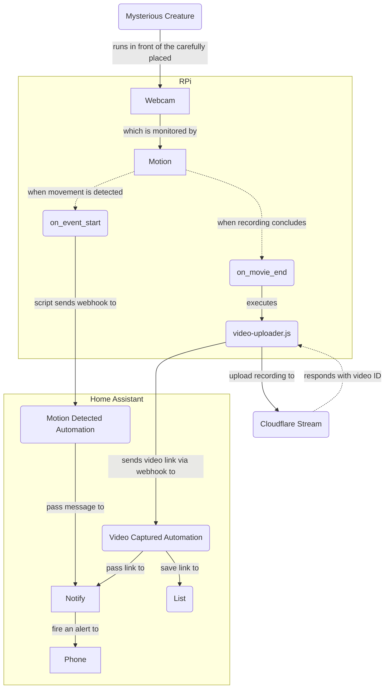

I recently moved into an old house which will surely become the subject of many
blog posts on _fun_ tinkering and gadgetry. But first...

One night, while quietly minding my own business, I heard a ruckus upstairs.
Realizing I had neither pets nor an upstairs, I let out the exasperated sigh of,
"Well, I suppose I know what my next project is."



But I needed to know two things:

1. How does this "friend" get in (and, _hopefully,_ out)?
2. How big and scary?



I didn't see anything obvious in the attic when I went up there. But being only
halfway unpacked, I had an old computer and conference room webcam in an
easy-to-reach box. I wondered if I could use these to alert me when uninvited
guests arrive --- and maybe even figure out how they get in. A
"[game camera](https://en.wikipedia.org/wiki/Camera_trap)," essentially.



_First deployment: Raspberry Pi taped to the roof and the camera taped to the sewer vent pipe over the bathroom ceiling._

## System Overview

I used a [Raspberry Pi (3rd Gen, Model B)](https://www.raspberrypi.com/products/raspberry-pi-3-model-b/)
running [Motion](https://motion-project.github.io/) and integrated it with
[Home Assistant](https://www.home-assistant.io/) (which powers all my home
automation gizmos) and [Cloudflare Stream](https://www.cloudflare.com/products/cloudflare-stream/)
(for easy video storage/playback).

Uploading video clips to Stream is a convenience feature not really necessary
for my mission, but I'm the Product Manager for Stream and this may make a funny
story for the office.

**Here's what it does:**

- When Motion detects movement in the camera's view, it starts recording. It also
  sends a [webhook](https://www.home-assistant.io/docs/automation/trigger/#webhook-trigger)
  to Home Assistant, which triggers that to
  [notify](https://www.home-assistant.io/integrations/notify/) my phone that
  we've been boarded.
- When Motion stops seeing movement, it will end the recording. When the video
  is saved locally, Motion calls a script I wrote to:
  - Upload the video to [Cloudflare Stream](https://developers.cloudflare.com/stream/).
  - Send the video link to Home Assistant.
  - Home Assistant then sends the link to my phone as an
    [actionable notification](https://companion.home-assistant.io/docs/notifications/actionable-notifications/#building-notification-action-scripts)
    and adds it to a [list](https://www.home-assistant.io/integrations/shopping_list/).




## Camera and Software

Previously, this webcam [monitored my 3D printer](). I looked at
[how OctoPrint handles video](https://octoprint.org/blog/2023/05/24/a-new-camera-stack-for-octopi/)
for that, which pointed me to projects like
[mjpg-streamer](https://github.com/jacksonliam/mjpg-streamer) and
[camera-streamer](https://github.com/ayufan/camera-streamer). But OctoPrint's
use-case is to record a print start-to-finish or show the printer's current
state on-demand. Not ideal; I need to know when something _happens._

Ultimately, I stumbled on a [tutorial](https://pimylifeup.com/raspberry-pi-webcam-server/)
that introduced me to [Motion](https://motion-project.github.io/), which can stream
the raw video via MJPEG, detect movement, trigger scripts, and save video clips
of just the movement (instead of giving me one long-running video to search through).

## Integrations

As noted, there are three ways I integrate with Motion:

- _"What's up there right now?"_ --- Motion as a video source in Home Assistant with its "Motion JPEG" video stream
- _"Intruder alert!"_ --- Motion &rarr; Home Assistant via webhook when movement is detected
- _"How did they get in?"_ --- Motion &rarr; Stream _and_ Home Assistant when a new video is captured

### _What's up there now?_ Watching the MJPEG in Home Assistant

Motion will start a "Motion JPEG" live stream by default, but it needs to be
configured to allow access from other hosts. See Motion's docs on
[Live Stream options](https://motion-project.github.io/motion_config.html#OptDetail_Stream)
for full details, but change this in `/etc/motion/motion.conf`

``` txt
# Restrict stream connections to the localhost.
stream_localhost off
```

In Home Assistant, add an "[MJPEG IP Camera](https://www.home-assistant.io/integrations/mjpeg)"
and point it to the computer running Motion, port 8081 by default. The `/stream`
endpoint is the video, the `/current` endpoint will return a still image on request.



The camera will display a static image on the overview. Click on it to open
a live view.



### _Intruder Alert!_ Triggering a Notification with a Webhook

Motion allows running commands on various events. Home Assistant allows webhooks
to trigger automations. Great combo.

**Gotcha:** There are _two_ relevant hooks in Motion,
[`on_motion_detected`](https://motion-project.github.io/motion_config.html#on_motion_detected)
and [`on_event_start`](https://motion-project.github.io/motion_config.html#on_event_start).
The "motion detected" hook will fire on every video frame with movement,
potentially dozens of times per second! My use-case is better suited to the
"event start" hook instead, which is also when Motion starts recording.

This is a simple cURL command in Motion's config:

``` txt
on_event_start curl -X POST -H "Content-Type: application/json" -d '{ "message": "Motion Detected" }' https://home-assistant.server/api/webhook/motion

```

In Home Assistant, an inbound webhook is just an automation trigger type. Create
a new automation and create a new "Webhook" trigger:



- The "Webhook ID" becomes part of the URL, at `//home-assistant.server/api/webhook/WEBHOOK_ID`.
- By default, webhooks are only allowed from local networks; uncheck that box if
  necessary. My Home Assistant server runs in a Docker container, so even the home
  network is "external." _(Beware the security implications of allowing webhooks_
  _from the public internet, particularly if it accepts input!)_

When this fires, my phone goes off:



### _How did it get in?_ Saving Recordings to Stream and Sending Links to me

Actual objective here: "I want to be able to watch the recording on my phone."
But as a Stream team member, I thought uploading them to us could be a "fun"
_(read: productive procrastination)_ way to achieve that.

#### Step 1: Motion settings for the video output

Here are relevant _excerpts_ of Motion's config file at
`/etc/motion/motion.conf`, with some notes.

``` txt
# >>> Change this to "off" because systemd starts this service
daemon off

# >>> Make sure the `motion` group has write access
target_dir /videos

# >>> This was where my webcam mounted, but may not be for you.
video_device /dev/video0

############################################################
# Image Processing configuration parameters
############################################################

width 1280
height 720
framerate 30

############################################################
# Motion detection configuration parameters
############################################################

# >>> I tweaked these, may tweak more... the docs are good
threshold 600
minimum_motion_frames 3
event_gap 15
pre_capture 5
post_capture 60

############################################################
# Script execution configuration parameters
############################################################

# >>> See above!
on_event_start

# >>> Explained below; handles Stream and Webhook #2
#     "%f" is a placeholder for the full path to the mp4
on_movie_end /videos/uploader/video-upload.js %f >> /videos/on_movie_end.log 2>&1

############################################################
# Movie output configuration parameters
############################################################

movie_output on
movie_max_time 600
movie_quality 80
movie_codec mp4
```

#### Step 2: Uploading to Stream

I provisioned an API token on Cloudflare's Dash for Stream to use in the script:



Some videos were too big to upload in a single request, so
[TUS](https://tus.io/) was the best way to get them posted. To be honest, this
was harder than I thought it would be --- good user research.

After some trial and error, I settled on writing the uploader in JavaScript and
using [`tus-js-client`](https://github.com/tus/tus-js-client). The Motion service
runs as its own account, so my usual recommendation of
"[do all Node management with NVM](https://github.com/nvm-sh/nvm)"
led to _many_ problems.

So I'll say this just-this-once, for this use-case only, and **never again**:



``` sh
# You almost certainly _do not_ want to do this in any other context.
sudo apt-get install nodejs node-npm
```

This library requires Node v18+, which is thankfully the default for Raspberry Pi's
[Bookworm](https://www.raspberrypi.com/news/bookworm-the-new-version-of-raspberry-pi-os/)
release.

The script is marked as an executable so it can be easily called from Motion's
config file. Its only direct dependency is `tus-js-client`.

``` js
#!/usr/bin/node

const fs = require('fs');
const tus = require('tus-js-client');

// Take the path to the video file as an argument, get info about it
const path = process.argv[2]
const file = fs.createReadStream(path);
const size = fs.statSync(path).size;

// Use this to store the video ID when we know it
let mediaId;

// Determine a date one month hence to automatically delete the video
const deletionDate = new Date();
deletionDate.setDate(deletionDate.getDate() + 31);

console.log(`Uploading ${path} (${size} bytes)`);

const options = {
  // Stream upload endpoint
  endpoint: 'https://api.cloudflare.com/client/v4/accounts/YOUR_ACCOUNT_TAG/stream',
  headers: {
    // API token with Stream access
    Authorization: 'Bearer YOUR_API_TOKEN',
  },
  chunkSize: 50 * 1024 * 1024, // Chunk size of 50MB
  metadata: {
    name: path, // this will be the video's title in Stream's UI
    scheduleddeletion: deletionDate.toISOString(), // scheduled deletion date
  },
  uploadSize: size,
  onError: function (error) {
    throw error;
  },
  onAfterResponse: function (req, res) {
    // Capture the video id from the stream-media-id header and save it
    const mediaIdHeader = res.getHeader('stream-media-id');
    if (mediaIdHeader) {
      mediaId = mediaIdHeader;
    }
  },
  onSuccess: function () {
    // Report success to the local logs
    console.log(`Upload finished. Stream video id: ${mediaId}`);

    // Fire a webhook to Home Assistant with the link to the video
    const notification = fetch('https://home-assistant.server/api/webhook/video-uploader', {
      method: 'POST',
      headers: {'Content-Type': 'application/json; charset=utf-8'},
      body: JSON.stringify({
        'message': 'Video Uploaded',
        // Stream player URL is https://customer-CODE.cloudflarestream.com/VIDEO_ID/iframe
        'link': `https://cloudflarestream.com/${mediaId}/iframe`,
      }),
    });
  },
};

const upload = new tus.Upload(file, options);
upload.start();
```

Once it executes, the video is listed in Stream:



#### Step 3: Sending the URL to Home Assistant

Reviewing the script above, after the upload is completed, it fires a webhook to
Home Assistant, which includes a link to the video in the payload.



So the inbound trigger setup is similar (just a new ID), but we're calling _two_
services this time:

**Send the link to me:** again using Home Assistant's `notify`, but including
another property with a link to watch the video on Stream, which will be
surfaced by the app as a notification _action._

``` yaml
service: notify.mobile_app_pixel_7a
data:
  title: Motion Notification
  message: "{{ trigger.json.message }}"
  data:
    actions:
      - action: URI
        title: Watch
        uri: "{{ trigger.json.link }}"
```

**Gotcha:** I didn't see the nested `data` property when I first set this up.
Actions have to go in `data.data.actions[]` as shown here...

This time, I get a notification with a "Watch" button:



**Save the link to a "[Shopping List](https://www.home-assistant.io/integrations/shopping_list)":**
which is, oddly, the only built-in way to create a Home Assistant
[To-Do List](https://www.home-assistant.io/integrations/todo/) (which cannot be
used directly?). Create the Shopping List first and use its `entity_id` in the
`todo.add_item` target.

``` yaml
service: todo.add_item
target:
  entity_id: todo.video_upload_list
data:
  item: "{{ trigger.json.link }}"
```



This way I can go back and get the link later if I miss the notification.

## Okay... so did it work?

Unfortunately. I woke up to several notifications a couple days later. In
total, it has captured five separate clips across two... "incursions."

<div style="position: relative; padding-top: 56.25%; margin-bottom: 2em;">
  <iframe
    src="https://customer-igynxd2rwhmuoxw8.cloudflarestream.com/f062bd35f29b67118a3ccf903218db24/iframe?preload=true&poster=https%3A%2F%2Fcustomer-igynxd2rwhmuoxw8.cloudflarestream.com%2Ff062bd35f29b67118a3ccf903218db24%2Fthumbnails%2Fthumbnail.jpg%3Ftime%3D2s%26height%3D600"
    style="border: none; position: absolute; top: 0; left: 0; height: 100%; width: 100%;"
    allow="accelerometer; gyroscope; autoplay; encrypted-media; picture-in-picture;"
    allowfullscreen="true"
  ></iframe>
</div>

Looks like it might just be one critter, potentially entering near the HVAC
coolant line... I wonder if the lights I've left on around the camera are a
deterrant, but I don't have an IR camera. (And would prefer not to have a reason
to buy one.)

I'm not sure the next steps need to be documented.

---

_\* Disclaimer: I am a Cloudflare employee, so some of our products are made available to me for free, including Stream and Tunnels (which I use for Home Assistant ingress). This is not intended as security guidance. It is also not the company's recommended approach for dealing with rodents._

_\*\* And no, I don't intend to kill it._
